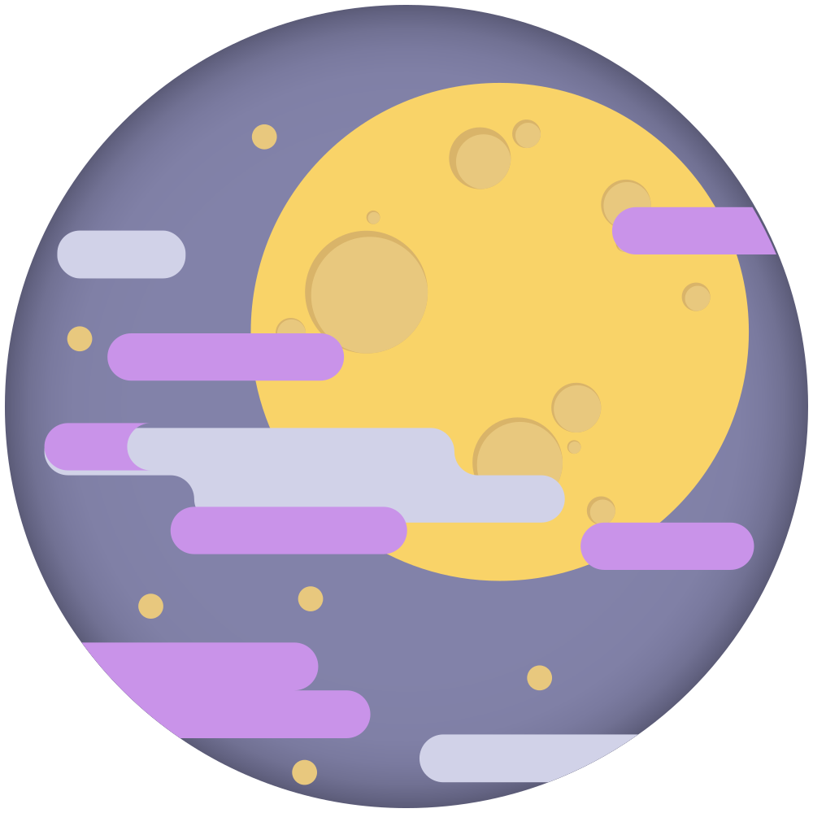

  
  <h3>Moonbloom Theme  🌙</h3>
  
Gentle on the eyes, evoking the cozy tranquility of a serene night.

  

    <samp>
      <a href="https://donate.teplostan.ski">support us</a>  ·  <a href="https://moonbloom.teplostan.ski">website</a>  ·  <a href="https://github.com/orgs/moonbloom-theme/discussions">discussions</a>
    </samp>
  

 

It's here!
On December 1st, the new Moonbloom dark theme dropped! 🎉

**Compatible with:**
- [Termux](https://github.com/moonbloom-theme/termux)
- [Zsh](https://github.com/moonbloom-theme/zsh)
- [Vivaldi](https://github.com/moonbloom-theme/vivaldi)
- [Alacritty](https://github.com/moonbloom-theme/alacritty)
- [Visual Studio Code](https://github.com/moonbloom-theme/visual-studio-code)

**Coming soon:**
- Zsh Syntax Highlighting
- Sublime Text
- Bat

Give it a try and let the glow of the night inspire you!

  

